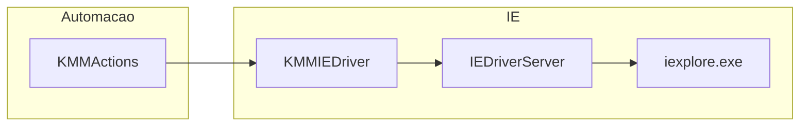

# KMM e Selenium (Internet Explorer)

Este documento descreve o **wrapper de automação IE** usado pelo KMM no repositório: classe **`KMMIEDriver`** ([`src/kmm/ie_driver/ie_driver.py`](../src/kmm/ie_driver/ie_driver.py)) e o consumo por **`KMMActions`** ([`src/kmm/services/kmm_actions.py`](../src/kmm/services/kmm_actions.py)). Os bots Arcelor, J Mendes e Belgo que falam com o KMM passam por `KMMActions`, que por sua vez usa o IE (não Chrome).

Documentação dos bots: [Arcelor](bots/arcelor.md), [J Mendes](bots/jmendes.md), [Belgo](bots/belgo.md).

Ver também: [Operação, ambiente e suporte](operacao-ambiente-agendamento-suporte.md) (VPN, VMs, agendamento, e-mail).

---

## Papel no projeto

- **`KMMIEDriver`:** camada única sobre `selenium.webdriver.Ie` com timeouts, capacidades IE, esperas explícitas, retries, evidências em disco e **watchdog** para operações que travam.
- **`KMMActions`:** orquestra o ciclo de vida (`start` / `stop`) no `__enter__` / `__exit__`, expõe login e passos de negócio chamando métodos do driver (`safe_click`, `safe_type`, `switch_to_frame`, etc.).

Fluxo típico:

---

## Configuração: `IEDriverConfig`

Dataclass em [`ie_driver.py`](../src/kmm/ie_driver/ie_driver.py) (valores padrão relevantes):

| Campo | Significado |
|-------|-------------|
| `driver_path` | Caminho ao `IEDriverServer.exe` (padrão `C:\IEDriverServer.exe`); `None` usa o PATH. |
| `page_load_timeout` / `script_timeout` | Limites em segundos para `get` e scripts. |
| `default_wait` | Timeout padrão dos `WebDriverWait`. |
| `evidence_dir` | Diretório para screenshots/HTML em falhas ou `dump_state`. |
| `evidence_maximize_before_screenshot` | Se `true`, maximiza a janela IE antes do PNG e restaura tamanho/posição depois. |
| `evidence_expand_to_full_page` | Se `true`, redimensiona a janela para `scrollWidth`/`scrollHeight` (limitado por `evidence_max_screenshot_height`). |
| `evidence_max_screenshot_height` | Altura máxima em pixels ao expandir para página com scroll (padrão `12000`). |
| `ignore_zoom_level` / `ignore_protected_mode_settings` | Refletidos em `IeOptions` e ajudam em ambientes com zoom ≠ 100% ou zonas de segurança desalinhadas. |
| `page_load_strategy` | Padrão `"normal"` (comentário no código: mais previsível no IE). |
| `kill_processes_on_stop` | Após `quit`, executa `taskkill` em `iexplore.exe` e `IEDriverServer.exe`. |
| `hard_timeout` / `hard_grace` | Segundos máximos para métodos “embrulhados”. O default da dataclass usa `int(os.getenv("KMM_HARD_TIMEOUT")) or 300` sem valor default no `getenv`; **defina `KMM_HARD_TIMEOUT` no `.env`** com um inteiro válido para evitar erro ao importar o módulo se `getenv` devolver `None`. |

Na construção do driver, o código força **`implicitly_wait(0)`**: **não** usar espera implícita no IE; todas as interações devem usar **`WebDriverWait`** (via `wait_*` / `safe_*`).

---

## Capabilities e opções na prática

Em `start()`:

- `DesiredCapabilities.INTERNETEXPLORER` com `pageLoadStrategy`, `ignoreProtectedModeSettings`, `ignoreZoomSetting`, `requireWindowFocus` (capabilities), `ie.ensureCleanSession`, `ie.browserCommandLineSwitches` = `-private`.
- `IeOptions`: `ignore_zoom_level`, `ignore_protected_mode_settings` e `full_page_screenshot` (`ie.enableFullPageScreenshot`) a partir do config.

Compatibilidade: se a assinatura `webdriver.Ie(executable_path=..., capabilities=..., options=...)` falhar com `TypeError`, o código faz fallback para a API mais antiga (`executable_path` posicional, sem `options`), típico de **Selenium 3**.

**Discrepância:** `IEDriverConfig` define `require_window_focus: bool = True`, mas nas capabilities o código fixa **`requireWindowFocus`: False**. O comportamento efetivo é o das capabilities em `start()`.

---

## Watchdog e destravar o IE

Vários métodos públicos estão listados em `_HARD_WRAP` e são executados dentro de **`_call_with_watchdog`**: a função corre numa **thread** à parte; a thread principal faz `join` com limite `hard_timeout + hard_grace`. Se a operação não terminar:

1. Tenta `dump_state` com etiqueta `hard_timeout_<nome_do_metodo>`.
2. Chama **`_kill_ie_processes`** (`taskkill` forçado em `iexplore.exe` e `IEDriverServer.exe`).
3. Levanta **`HardTimeoutError`**.

Isto é específico de IE: chamadas ao driver podem bloquear indefinidamente; matar o processo é a estratégia de recuperação.

Em `stop()`, após `quit()`, se `kill_processes_on_stop` for verdadeiro, volta a matar processos para garantir limpeza.

---

## Locators e métodos `safe_*`

- **Formato de locator:** string `"tipo:valor"` (ex.: `"id:USUARIO"`, `"xpath://button[@title='Entrar']"`) ou tupla `("id", "USUARIO")`. Tipos suportados em `_by`: `id`, `css`, `xpath`, `name`, `tag`, `class`, `link`, `plink`.
- **`safe_click`:** espera clicável; em falha de clique nativo (`ElementClickInterceptedException`, `ElementNotInteractableException`, `WebDriverException`), pode usar **`execute_script("arguments[0].click();", el)`** — comum no IE.
- **`safe_type`:** limpa o campo (ou zera via JS se `clear` falhar); opcionalmente digita caractere a caractere com pausa (`time_between_types`).
- **`_with_retry`:** reexecuta em `StaleElementReferenceException`, `WebDriverException`, `TimeoutException`, `NoSuchElementException`; no último insucesso gera evidência com `dump_state`.

Frames KMM: `switch_to_frame` assume frame `id:principal` e, se não for só o principal, `name:iconteudo`.

---

## Evidências e limpeza

- **`dump_state(label)`:** grava PNG, HTML da página e ficheiro de meta (URL) com nome único sob `evidence_dir`. O PNG usa `_save_evidence_screenshot`: maximiza temporariamente a janela (evita corte quando não está maximizada), expande para o tamanho do documento quando `evidence_expand_to_full_page` está ativo e restaura posição/tamanho da janela no `finally`.
- **`full_page_screenshot`:** ativado em `start()` (`ie.enableFullPageScreenshot`) para o IEDriverServer capturar o canvas completo da página.
- **`cleanup_old_evidences(days=10)`:** no `__init__` do driver, remove ficheiros de evidência mais antigos que o limiar.

Se o PNG continuar truncado em Windows 64-bit, confirme que a arquitetura do `IEDriverServer.exe` (32 vs 64 bits) corresponde ao IE instalado — limitação conhecida do driver legado.

---

## Checklist operacional (Windows + IE)

1. **IEDriverServer** compatível com a versão do Selenium e arquitetura (32/64 bits) alinhada ao IE instalado (relevante também para screenshots completos).
2. **Zoom 100%** em todas as zonas; o código tenta `ignoreZoomSetting`, mas evitar zoom evita surpresas.
3. **Protected Mode** consistente entre zonas de segurança do IE, ou confiar nas flags `ignoreProtectedModeSettings` (já ativas no código).
4. **Sessão limpa:** `ensure_cleanSession` e `-private` reduzem estado residual entre execuções.
5. **Não minimizar** a janela durante a automação se o site ou o driver dependerem de pintura/foco (menos crítico com `requireWindowFocus` false nas capabilities).
6. **Máquina dedicada ou agendamento** sem sobreposição de dois robots no mesmo perfil IE, para evitar corrida no mesmo `iexplore.exe`.

---

## Contexto

O **Internet Explorer** está descontinuado pela Microsoft; o projeto mantém-o porque o **KMM** legado corre nesse browser. Novas funcionalidades devem continuar a respeitar `implicitly_wait(0)` e padrões `safe_*` / `wait_*` já estabelecidos.

---

## Referência de código

| Ficheiro | Conteúdo |
|----------|----------|
| [`src/kmm/ie_driver/ie_driver.py`](../src/kmm/ie_driver/ie_driver.py) | `IEDriverConfig`, `KMMIEDriver`, waits, safe_*, evidências, kill |
| [`src/kmm/services/kmm_actions.py`](../src/kmm/services/kmm_actions.py) | `KMMActions`, `LoginParams`, login e ações de negócio |
