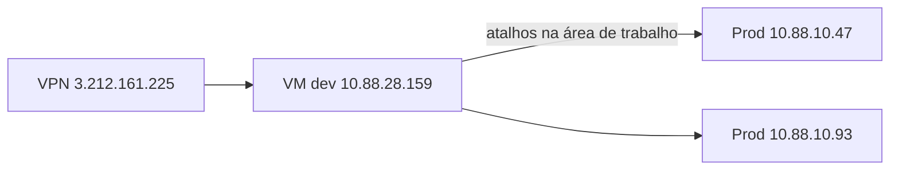

# Operação: ambiente, agendamento e suporte

Este documento descreve **onde** as automações correm (VPN e VMs), **quando** são agendadas (regra de negócio e comportamento do código), **como** disparar por e-mail e **quem** contactar. **Palavras-passe não constam aqui** — use cofre de segredos ou responsável interno.

Documentação técnica dos bots: [Arcelor](bots/arcelor.md), [J Mendes](bots/jmendes.md), [Belgo](bots/belgo.md). Driver KMM (IE): [KMM e Selenium (Internet Explorer)](kmm-selenium-internet-explorer.md).

---

## Fluxo de acesso (VPN e máquinas)

| Etapa | Detalhe |
|-------|---------|
| **VPN** | Host `3.212.161.225`; utilizador `rpafreto`. Credencial VPN junto da equipa de infraestrutura (não versionar). |
| **VM de desenvolvimento** | IP `10.88.28.159`. A partir desta máquina acede-se às VMs de produção; existem **atalhos na área de trabalho** para as VMs de prod. |
| **Produção — Arcelor e J Mendes** | IP `10.88.10.47`. Conta Windows típica da RPA: utilizador `rpa`. Deve correr o processo associado a [`main_47.py`](../main_47.py) (ver secção “Orquestração”). |
| **Produção — Belgo** | IP `10.88.10.93`. Conta Windows: `rpa.belgo`. Deve correr o processo associado a [`main_93.py`](../main_93.py). |

**Requisitos no servidor:** Windows, raiz do repositório como diretório de trabalho, [`uv`](https://github.com/astral-sh/uv) disponível, ficheiro `.env` com variáveis (base de dados, e-mail, KMM, etc.). O KMM usa Internet Explorer — ver documento do driver.

---

## Orquestração (`main_47` vs `main_93`)

Cada ficheiro é um **loop contínuo** (`while True`) que:

1. Às **horas agendadas** (ver tabelas abaixo), executa `uv run -m src.bots.<bot>.publisher` e em seguida `uv run -m src.bots.<bot>.worker` com `cwd` na raiz do projeto (`Path.cwd()`).
2. Lê a caixa de e-mail configurada em [`src/shared/email_handler.py`](../src/shared/email_handler.py) (`EMAIL_ERGON` / `EMAIL_PASS_KEY`) e pode disparar bots conforme o **assunto** do e-mail.

| Ficheiro | VM típica | Agendamento por relógio | E-mail: o que processa |
|----------|-----------|-------------------------|-------------------------|
| [`main_47.py`](../main_47.py) | `10.88.10.47` | Arcelor | Ignora pedidos cujo assunto contém `belgo`. Aceita `arcelor`, `jmendes`, `jjmendes`. |
| [`main_93.py`](../main_93.py) | `10.88.10.93` | Belgo | Ignora `arcelor` e `jmendes` / `jjmendes` no ramo de e-mail; trata **belgo** por e-mail neste host. |

Notificações de início/fim dos ciclos agendados e por e-mail são enviadas para o endereço hardcoded nos `main_*.py` (recomenda-se migrar para variável de ambiente).

---

## Agendamento por relógio

### Horários acordados (negócio)

| Automação | Horários (hora local da VM) |
|-----------|-----------------------------|
| **Arcelor** | 03:00, **14:30**, 16:00 |
| **Belgo** | 07:00, **08:30**, **10:30**, 18:00, 20:00, 21:00 |
| **J Mendes** | Sem agendamento fixo neste trigger; uso principal por **e-mail** (ver seguinte secção). |

### Implementação atual no código (pode diferir dos horários acima)

O código usa apenas **`datetime.now().hour`**, sem minutos:

| Ficheiro | Condição atual | Efeito prático |
|----------|----------------|----------------|
| [`main_47.py`](../main_47.py) | `hour in {3, 14, 16}` | Arcelor corre no **primeiro ciclo** após entrar na hora **3, 14 ou 16** (ex.: às 14:00–14:59, não especificamente às 14:30). |
| [`main_93.py`](../main_93.py) | `hour in {7, 8, 10, 18, 20, 21}` | Belgo dispara no primeiro ciclo da hora **8** e **10**, não às 8:30/10:30. |

Para alinhar **14:30**, **8:30** e **10:30** ao minuto, é necessário alterar o código (por exemplo testar `hour` e `minute`) ou usar um agendador externo que invoque publisher/worker nesses instantes.

---

## Disparo e suporte por e-mail

### Caixa monitorizada

- **`suporte@ergondata.com.br`** — a leitura IMAP/SMTP usa as credenciais em `.env` (`EMAIL_ERGON`, `EMAIL_PASS_KEY`); não documentar valores neste repositório.

### Como pedir uma execução manual

Envie um e-mail **para essa caixa** com o **assunto** indicando a automação (o código normaliza para minúsculas na leitura):

| Assunto (exemplo) | Bot |
|-------------------|-----|
| `arcelor` | Arcelor |
| `belgo` | Belgo |
| `jmendes` ou `JMENDES` ou `jjmendes` | J Mendes (`jjmendes` é alias legado no código) |

**Requisito importante:** em [`main_47.py`](../main_47.py) e [`main_93.py`](../main_93.py), após a leitura, o assunto guardado é comparado por **igualdade** à lista `['jmendes', 'jjmendes', 'arcelor', 'belgo']`. O valor já vem em **minúsculas** (ver fluxo em [`read_emails`](../src/shared/email_handler.py)). Assim, o assunto deve ser **exatamente** uma dessas palavras (ex. `jmendes`), não frases como `Pedido jmendes` — caso contrário o sistema responde ao remetente com erro.

### Quem processa o e-mail

- Pedidos na caixa de suporte são filtrados por remetente (`freto` ou `ergondata` no domínio, em [`read_emails`](../src/shared/email_handler.py)).
- Consoante **qual** `main_*.py` está em execução em cada VM, parte dos assuntos é **ignorada** (ver tabela “Orquestração”). Garanta que o pedido é tratado pela VM correta ou que ambos os loops estão alinhados com a política desejada.

### Suporte Ergondata

- Canal operacional e disparos: **suporte@ergondata.com.br**.
- Mensagens de erro aos utilizadores (ex. [publisher J Mendes](../src/bots/jmendes/publisher.py)) referem acionar suporte Ergondata.
- Relatórios e anexos por bot usam destinatários em `.env`: `ARCELOR_RECIPIENTS`, `JMN_RECIPIENTS`, `BELGO_RECIPIENTS`.

---

## Referência rápida

| Tópico | Onde está no código |
|--------|---------------------|
| Loop Arcelor + e-mail (exceto belgo) | [`main_47.py`](../main_47.py) |
| Loop Belgo + e-mail (belgo) | [`main_93.py`](../main_93.py) |
| Leitura IMAP / envio SMTP | [`src/shared/email_handler.py`](../src/shared/email_handler.py) |
| Publisher / worker por bot | `src/bots/<bot>/publisher.py`, `src/bots/<bot>/worker.py` |
